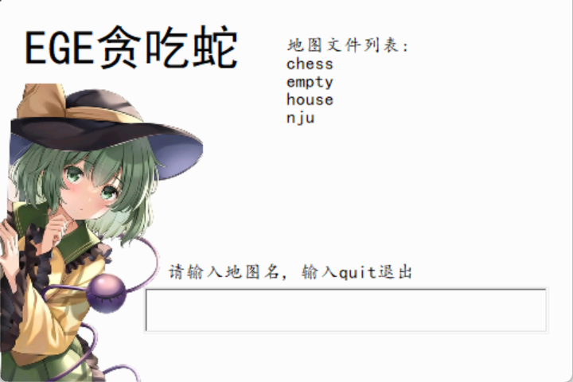
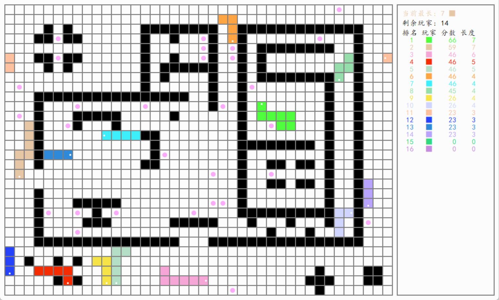

# 大作业: EGEsnake

+ 2023.3.17 - 2023.3.31

+ 第三方图形库: EGE 20.08

+ C++标准: C++20

+ IDE: clion

+ 操作系统: windows

---

#### 操作方法

+ 打开EGEsnake.exe进入游戏

+ 依次输入地图名称, 玩家个数, 总玩家数, 以及颜色选择

+ 游戏结束后按任意键回到标题界面

+ 按键:

  >W S A D :  玩家一
  >
  >I K J L :     玩家二
  >
  >↑↓←→ :    玩家三
  >
  >Esc:           退出游戏
  >
  >R:               回到标题界面

---

#### 设计概要

##### 程序结构

main.cpp: 程序入口

head.h: 通用的头文件, 宏, 和枚举

structs.cpp structs.h: 链表的实现, 以及主类Snake, 辅助类GlobalData和ColorGroup

paint.cpp paint.h: 使用EGE实现图形化以及绘图相关函数

play.cpp play.h: 游戏逻辑部分相关代码

others.h others.cpp: 随机与AI相关的辅助函数

##### 流程示意图

##### 关键点

+ 关于Snake类:

​	表示贪吃蛇的方法是, 每个节点中包含横纵坐标, 而贪吃蛇则可用由这些节点组成的链表表示, 这样的好处是增添节点和删除节点(贪吃蛇移动)的成本很低, 并且只需要指向头和尾的两个指针, 大大减少了复杂性

+ 关于AI:

​	使用递归遍历之后若干步的所有情况, 并对每种情况打分, 从而对各个方向选择的优劣进行评估, 以此按权重进行随机选择

+ 关于得分算法:

​    游戏开始后数秒开始计分并进行实时排名, 存活的贪吃蛇每秒能加一分, 而长度较高的贪吃蛇获得分数更高, 贪吃蛇死后分数并不清零, 游戏结束后会列出分数, 长度和存活时间最高者

+ 关于游戏地图: 

详见map/地图规约.txt

#### 总结

虽然之前也有过使用C语言的SDL2库做出飞行棋的经历, 但这次用EGE实现贪吃蛇也并不轻松. EGE仍然是一个较为简单基础的图形库, 因此想要完成一个漂亮又对玩家友好的图形界面仍需要繁琐的代码和不断尝试. 

相比于飞行棋, 贪吃蛇的游戏流程较为复杂(尤其在多人系统下), 核心循环就是`接受输入-AI决策-更新状态-绘制图形-...`, 将游戏分成这四个板块能有效地降低开发的复杂度, 这次项目也用到了面向对象的思想, 但具体使用过程中经验还不够丰富. 

这次的贪吃蛇要想胜利也有一定的难度, 另外多人模式和多张地图也增加了游戏性, 可以算作是完成了一个粗糙的游戏. 当然, 要想做出更完善的项目来, 还需要更先进的设计思想与更完善的开发工具, 而这也是我们未来将要继续学习的内容.

*by 张科鹏 221900212*

*github: https://github.com/PrismCC/project-EGEsnake.git*